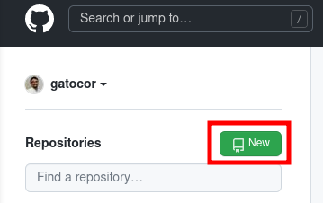

# SoftwareReproducibilityTutorial
Repository which explain all the basics from how to set up a good computational working environment to make it fully reproducible for sharing with the world.

# The problem of software reproducibility

The computational analysis are prone to reproducibility problems due to set of different factors:

1. There are different ways of solving the same problem (algorithm differences).
2. There are different implementations of these algorithms (alternative packages and software versions).
3. The algorithms can be non-deterministic (stochasticity)
4. Even different computers with the software can have slightly different results (different operative systems...).

In the following will deal with all these problems and learn how to create a reproducible environment.

## Software requirements

For the following tutorial you will need to install in your computer the following software. 

**Required:**

1. [git](https://git-scm.com/)
2. [docker](https://www.docker.com/)

**Optional:** 

1. [Visual Studio Code](https://code.visualstudio.com/): In case you do not have a or you would like to make a good programming environment.
2. [python](https://www.python.org/): To follow all the examples, you can use any other language that you like.
3. [jupyter](https://jupyter.org/): To follow all the examples, you can use any other language that you like.

Moreover, if you have not yet got one, you should obtain a [github account](https://github.com/).

# Step 0: Set up an appropiate programming environment

Having a good programming environment can greatly help you when developing your projects. By good programming langeage we mean any software that helps you debug your program, highlight your code... in general that makes your life easier.

For that tutorial we recomend to use [Visual Studio Code](https://code.visualstudio.com/)(VSCode). We do not get money for promoting it, is a personal advice and if you feel confident programming in other environments, go for them.

A few things that make a very handful program:

1. Integrates almost all programing languages you want to work with in a single program.
2. Integrates git functionality by default
3. Synchronization with github is straightforward
4. If VSCode is installed in other computer, you can work with it remotely through SSH with no more complications.
5. Open interactive files like `Jupyter notebooks` directly in the environment.
6. Preview data, files in common formats...

You can see a basic functionality in the following image.


## Hands on: Installing the extensions

In order to recognise the languages to highlight the code, among other tools, we need to add some extensions to VSCode.

For that we click on the extensions button in the vertical left pannel or `Ctrl+Shift+X`. The extension marketplace will appear. For the folling you will need to add `Python`, `Julia` and `Docker`.

Many packages for all languages exist, as well as additional funionalities. For example, if you want to work with remote computers, you can add `Remote - SSH` for accessing though VSCode your projects remotely and work with them.

# Step 1.1: git - Keep track of your code

Our aiming to make reproducible analysis is to make our code available to everyone. But before that, it is necessary to have some knowledge on how to keep track of the development of your code. Sometimes we try many things, some work, some not, sometimes you delete something and ruin it all and you do not remember when, how and why it stopped working. [git](https://git-scm.com/) is a program that helps you keep track of everything that happened to your code in a project. Among the things that git does are:

1. Keeping versions of your code as you develop them
2. Make alternatives/branches to the current working code
3. Keep all the machinery of sharing your code trough platforms as github

There are a lot of good tutorials around:

- [Intro to git and Github from EarthLab](https://www.earthdatascience.org/workshops/intro-version-control-git/)
- [Quite complete guide (in spanish)](https://www.atlassian.com/es/git/tutorials/learn-git-with-bitbucket-cloud)
- [Supercomplete guide with progressive teaching](https://www.w3schools.com/git/default.asp?remote=github)

## Hands on: Make your first git project

> **Configurating your git**\
> Before using git for the first time, is convenient to set up some information for the setting up process. This information includes how is making the modifications, contact email, etc...
> 
> ```
> $ git config --global user.name "Your Name"
> $ git config --global user.email "your-email-used-for-github-acct@email.com"
> ```
> 

Create a folder in a place confortable place in your computer. We will call it for the purposes of this tutorial `MyFirstGit`.

Working within a terminal (at least in Linux systems), this would be the way to do it. 

```
$ mkdir MyFirstGit
```

and move inside the folder.

```
$ cd MyFirstGit
```

and we can check that our folder is empty

```
$ ls

$ ls .*

```

Now we will initialise our repository,

```
$ git init
```

now we can check that a set of invisible folders (folders that start by a point are not normally shown) have been created in the folder

```
$ ls

$ ls .*
branches  config  description  HEAD  hooks  info  objects  refs
```

this are folders that git uses for keeping track of your code.

With everything set up, we can start our project. Let's create inside the folder a simple python file called `HelloGit.py`.

```python
#HelloGit.py
print("Hello git")
```

Now we have to tell git to keep track of this file. For that we do:

```
$ git add HelloGit.py
$ git commit -m "Added hello world"
[master (commit racine) 2776378] Added hello world
 1 file changed, 1 insertion(+)
 create mode 100644 HelloGit.py
```

The first line tells what to keep track since the last save point to the next save point. The second line says to actually save it and add a message to the saving point so you can remember what is that commit about. 

>**Shortcuts**
>
>If all the files of the project are going to be saved for the next save point, you can include them all as:
>
>```
> $ git add *
> $ git commit -m "Message that you want to include"
>```
>
>Other alternative is that once you are happy with the current code, you add all the files and commit them, this can be shorten to a single line as:
>
>```
> $ git commit -a -m "Message that you want to include"
>```
> Notice that this option updates only those files that are already included in the tracking.

Let's check our commitments logline.

```
$ git log
```

and somethind like the following will appear.

```
commit 2776378f9a38a34b9a3c64e4ba39ebec56b39594 (HEAD -> master)
Author: YourName <youremail@email.com>
Date:   Thu Sep 23 11:33:15 2021 +0200

    Added hello world
(END)
```

You can exit this screen with `Ctrl+Z`.

So far, so good. We are happy with our code and everything is working. We want ot keep this as it is but we want to try something new. For that we make a brach.

```
$ git branch AlternativeCode
```

This will generate a parallel environment where to code, safely knowing that you original work is intact in case this is fruitless.

We can check our branches with:

```
$ git branch -l
```

that will show something like this:

```
  AlternativeCode
* master
(END)
```

indicating with a `*` the branch you are working in. Alternatively we can simply show the current by writing 

```
$ git branch --show-current
master
```

which will simply show the current branch. We can now move to the new branch now to start working there.

```
$ git switch AlternativeCode
$ git branch --show-current
AlternativeCode
```

Let's modify our python code. For example, we could write now:

```python
#HelloGit.py
print("Hello git. We are in the second branch now.")
```

and let's commit the changes

```
$ git commit -a -m "Modified python in our second branch."
```

We can now check that in the two branches, the python file is different.

```
$ python HelloGit.py
Hello git. We are in the second branch now
$ git switch master
$ python HelloGit.py
Hello git.
```

Nice! once we are happy with our branch and solved all the problems that we have with it, we may want our branch to me included in the master branch, which is the one having the actual working code. For doing that we call a merge **from the branch we want things to be mergen in**.

```
$ git merge AlternativeCode 
Mise à jour 2776378..d81bb36
Fast-forward
 HelloGit.py | 2 +-
 1 file changed, 1 insertion(+), 1 deletion(-)
```

And now if we run the code in `master`, we have the modifications of branch.

```
$ python HelloGit.py
Hello git. We are in the second branch now
```

We have successfully started a git repository, commited some projects and made branches to develop your code. There is a lot more behind git, but with this basic steps you can already start to develop projects. I highly advise to go for the more advanced tutorials to master git.

## Hands on if you use Visual Studio Code:

Try to do the steps we have done with the command line but in VSCode. you will find it very easy once you find the places.

Tips:

0. Directly create a git repository in a new forlder if it does not exist yet in `Version control`.
1. In the left vertical bar you will find `Version control`, where it says all the files are modified between commitments. you can commit everything directly just adding a message and clicking check.
2. Check your branch and make new branches with the button in the bottom left corner.

# Step 1.2: GitHub - make your code publicly available

We aim to make or code publicly. For that we use a GitHub. This is a Web platform where to upload all our code and projects for everyone to be accessed.

## Hands on: Making our first public repository

Enter in your account of github and click on `New repository`.



There is a few parameters to specify:

- Owner: could be your private account or an account from an institution you form part (as **dsb-lab** in this case).
- Repository name
- Short description of the project
- Public/Private: Just notice that private repositories have a limited storage and can only be seen by you.
- Add a README file: This file is where you explain your code, what it does, how it is organized...
- Add .gitignore: I do not put it at first, we will discuss it later
- Add a license: This is a document that basically says how people can use your code (reproduce it, modify it, sell it...)

Once everything is ready we can create the repository.

Okey, we have an empty repository online. But we work from our local computer so the first thing we have to do is to get this repository from the internet and bring it to our computer. We will again use our friend git again. In the folder you want to keep your repository open a terminal and execute:

```
$ git clone https://github.com/yourGithubName/myFirstGithubRepository
```

Now, we can write our code freely in here as we used in git. Before we can save the things in github, we need to generate an autentification way, the most simple is to generate a token.

> **How to set up an autentification token**
>
> In `Settings>Developer settings> Personal access tokens` you can create a token. A token is a temproal password for accesssing and managing your repositories. When wanting to upload your modificated code, instead of the password of your account, you use this code.
>

In the moment that we are ready for saving it in Gihub, we do,

```
$ git push -u origin main
Username for 'https://github.com': yourGithubName
Password for 'https://yourGitHubName@github.com':  *put in here your token password*
```

where `main` is the name of the master branch generated directly by github. For saving all the branches you are working with all at once,

```
$ git push -u origin --all
Username for 'https://github.com': yourGithubName
Password for 'https://yourGitHubName@github.com':  *put in here your token password*
```

Now you can refresh your github account and check your successfully uploaded the progress of your project!

## What files should be included in GitHub?

Only those files that are code for the programming. As a thumb rule, personal information, data, all auxiliary files that is generated during the execution of the shouldn't be included. For avoining to upload those files, we create a file that is called `.gitignore`.

Imagine that our python code looks something like:

```python
#HelloGithub.py

import pandas as pd

data = pd.DataFrame(columns=["Column1","Column2"])
data.to_csv("dataGenerated.csv")
```

when execunting this code, we will generate a file inside the repository. If we just commit all that inside the repository to github, we will be uploading this file too. To avoid such situation, we just add the file to `.gitignore`.

```
#.gitignore

dataGenerated.csv
*.csv #In case you want to skip all the files with the same pattern.
```

## Hands on if you use VSCode

In VSCode is very easy to Synchronize your packages. Every time you want to put your modifications to the online server, just push the Sync button at the bottom left corner.

For more help, read: [https://code.visualstudio.com/docs/editor/github](https://code.visualstudio.com/docs/editor/github)

# Step 2: Docker - Making a reproducible computational environment

So far we have a control of the code we develop, we can share it with everyone but... they do not have our computer, with exactly the same packages that I used to perform my work or anything similar. Here comes to play [docker](https://www.docker.com/). Docker is a way of making "computational environments" that you can share with everyone. 

There are some other alternatives to mkae reproducible conditions:

- **Virtual Machines**: They make a hole copy of a computer inside your computer. They are very heavy and slow as they reproduce everything a computer has to do. 
- **Virtual Environments** (Only for Python and some other languages): They use the specified packages and versions that you need to use. They are a partial solution as many analysis do require different programs.

## Hands on: using our first Dockers

Dockers already exist for a vast set of utilities. You can find many made dockers at [DockerHub](https://hub.docker.com/).

For our purposes, let's download a docker.

