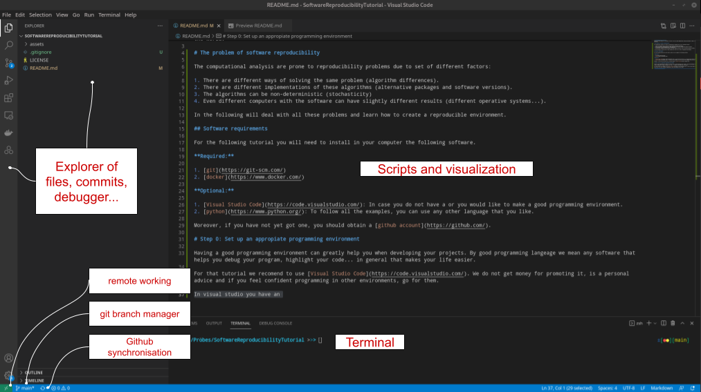

# SoftwareReproducibilityTutorial
Repository which explain all the basics from how to set up a good computational working environment to make it fully reproducible for sharing with the world.

# The problem of software reproducibility

The computational analysis are prone to reproducibility problems due to set of different factors:

1. There are different ways of solving the same problem (algorithm differences).
2. There are different implementations of these algorithms (alternative packages and software versions).
3. The algorithms can be non-deterministic (stochasticity)
4. Even different computers with the software can have slightly different results (different operative systems...).

In the following will deal with all these problems and learn how to create a reproducible environment.

## Software requirements

For the following tutorial you will need to install in your computer the following software. 

**Required:**

1. [git](https://git-scm.com/)
2. [docker](https://www.docker.com/)

**Optional:** 

1. [Visual Studio Code](https://code.visualstudio.com/): In case you do not have a or you would like to make a good programming environment.
2. [python](https://www.python.org/): To follow all the examples, you can use any other language that you like.
3. [jupyter](https://jupyter.org/): To follow all the examples, you can use any other language that you like.

Moreover, if you have not yet got one, you should obtain a [github account](https://github.com/).

# Step 0: Set up an appropiate programming environment

Having a good programming environment can greatly help you when developing your projects. By good programming langeage we mean any software that helps you debug your program, highlight your code... in general that makes your life easier.

For that tutorial we recomend to use [Visual Studio Code](https://code.visualstudio.com/)(VSCode). We do not get money for promoting it, is a personal advice and if you feel confident programming in other environments, go for them.

A few things that make a very handful program:

1. Integrates almost all programing languages you want to work with in a single program.
2. Integrates git functionality by default
3. Synchronization with github is straightforward
4. If VSCode is installed in other computer, you can work with it remotely through SSH with no more complications.
5. Open interactive files like `Jupyter notebooks` directly in the environment.
6. Preview data, files in common formats...

You can see a basic functionality in the following image.



## Hands on: Installing the extensions

In order to recognise the languages to highlight the code, among other tools, we need to add some extensions to VSCode.

For that we click on the extensions button in the vertical left pannel or `Ctrl+Shift+X`. The extension marketplace will appear. For the folling you will need to add `Python`, `Julia` and `Docker`.

Many packages for all languages exist, as well as additional funionalities. For example, if you want to work with remote computers, you can add `Remote - SSH` for accessing though VSCode your projects remotely and work with them.

# Step 1: git - Keep track of your code

The first thing when writing code is to keep track of your code. Sometimes we try many things, some work, some not, sometimes you delete something and ruin it all and you do not remember when, how and why it stopped working. [git](https://git-scm.com/) is a program that helps you keep track of everything that happened to your code in a project. Among the things that git does are:

1. Keeping versions of your code as you develop them
2. Make alternatives/branches to the current working code
3. Keep all the machinery of sharing your code trough platforms as github

## Hands on: Make your first git project

Create a folder in a place confortable place in your computer. We will call it for the purposes of this tutorial `MyFirstGit`.

Working within a terminal (at least in Linux systems), this would be the way to do it. 

```
> mkdir MyFirstGit
```

and move inside the folder.

```
> cd MyFirstGit
```

and we can check that our folder is empty

```
> ls

> ls .*

```

Now we will initialise our repository,

```
> git init
```

now we can check that a set of invisible folders (folders that start by a point are not normally shown) have been created in the folder

```
> ls

> ls .*
branches  config  description  HEAD  hooks  info  objects  refs
```

this are folders that git uses for keeping track of your code.

With everything set up, we can start our project. Let's create inside the folder a simple python file called `HelloGit.py`.

```python
#HelloGit.py
print("Hello git")
```

Now we have to tell git to keep track of this file. For that we do:

```
> git add HelloGit.py
> git commit -m "Added hello world"
```

The first line tells what to keep track since the last save point to the next save point. The second line says to save it and add a message to the saving point so you can remember what is that commit about. Alternatively, if you have many files or all the files of the project are going to be saved for the next save point, you can include them all as:

```
> git add *
```

! Note


